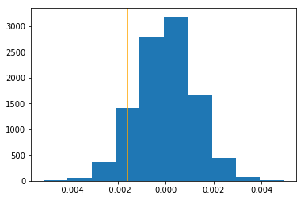

## Analyze A/B Test Results


## Table of Contents
- [Introduction](#intro)
- [Part I - Probability](#probability)
- [Part II - A/B Test](#ab_test)
- [Part III - Regression](#regression)

<a id='intro'></a>
### Introduction

For this analysis, the goal is to help the company understand if they should implement the new page, keep the old page, or perhaps run the experiment longer to make their decision.

<a id='probability'></a>
#### Part I - Probability


```python
import pandas as pd
import numpy as np
import random
import matplotlib.pyplot as plt
%matplotlib inline
#We are setting the seed to assure you get the same answers on quizzes as we set up
random.seed(42)
```

`1.` Now, read in the `ab_data.csv` data. Store it in `df`.

a. Read in the dataset and take a look at the top few rows:


```python
df = pd.read_csv('ab-data.csv')
```


```python
df.head()
```


<table border="1" class="dataframe">
  <thead>
    <tr style="text-align: right;">
      <th></th>
      <th>user_id</th>
      <th>timestamp</th>
      <th>group</th>
      <th>landing_page</th>
      <th>converted</th>
    </tr>
  </thead>
  <tbody>
    <tr>
      <th>0</th>
      <td>851104</td>
      <td>2017-01-21 22:11:48.556739</td>
      <td>control</td>
      <td>old_page</td>
      <td>0</td>
    </tr>
    <tr>
      <th>1</th>
      <td>804228</td>
      <td>2017-01-12 08:01:45.159739</td>
      <td>control</td>
      <td>old_page</td>
      <td>0</td>
    </tr>
    <tr>
      <th>2</th>
      <td>661590</td>
      <td>2017-01-11 16:55:06.154213</td>
      <td>treatment</td>
      <td>new_page</td>
      <td>0</td>
    </tr>
    <tr>
      <th>3</th>
      <td>853541</td>
      <td>2017-01-08 18:28:03.143765</td>
      <td>treatment</td>
      <td>new_page</td>
      <td>0</td>
    </tr>
    <tr>
      <th>4</th>
      <td>864975</td>
      <td>2017-01-21 01:52:26.210827</td>
      <td>control</td>
      <td>old_page</td>
      <td>1</td>
    </tr>
  </tbody>
</table>
</div>


b. Find the number of rows in the dataset


```python
df.shape[0]
```


    294478


c. The number of unique users in the dataset


```python
df.nunique()
```


    user_id         290584
    timestamp       294478
    group                2
    landing_page         2
    converted            2
    dtype: int64


d. The proportion of users converted


```python
df['converted'].mean()
```


    0.11965919355605512


e. The number of times the new_page and treatment don't line up


```python
df.query('(group=="control" and landing_page=="new_page") or (group=="treatment" and landing_page=="old_page")').count()
```


    user_id         3893
    timestamp       3893
    group           3893
    landing_page    3893
    converted       3893
    dtype: int64


f. Do any of the rows have missing values?


```python
df.isnull().any()
```


    user_id         False
    timestamp       False
    group           False
    landing_page    False
    converted       False
    dtype: bool


`2.` For the rows where **treatment** is not aligned with **new_page** or **control** is not aligned with **old_page**, we cannot be sure if this row truly received the new or old page.

a. Create a new dataset that meets the specifications, and store the new dataframe in df2.


```python
df2 = df.query('(group=="control" and landing_page=="old_page") or (group=="treatment" and landing_page=="new_page")')
```


```python
# Double Check all of the correct rows were removed - this should be 0
df2[((df2['group'] == 'treatment') == (df2['landing_page'] == 'new_page')) == False].shape[0]
```


    0


`3.` Characteristics of **df2**

a. The number of unique **user_id**s in **df2**


```python
df2.nunique()
```


    user_id         290584
    timestamp       290585
    group                2
    landing_page         2
    converted            2
    dtype: int64


b. Duplicated **user_id** in **df2**.


```python
df2[df2['user_id'].duplicated()]['user_id']
```


    2893    773192
    Name: user_id, dtype: int64


c. The row information for the duplicated **user_id**? 


```python
df2[df2['user_id'].duplicated()]
```


<table border="1" class="dataframe">
  <thead>
    <tr style="text-align: right;">
      <th></th>
      <th>user_id</th>
      <th>timestamp</th>
      <th>group</th>
      <th>landing_page</th>
      <th>converted</th>
    </tr>
  </thead>
  <tbody>
    <tr>
      <th>2893</th>
      <td>773192</td>
      <td>2017-01-14 02:55:59.590927</td>
      <td>treatment</td>
      <td>new_page</td>
      <td>0</td>
    </tr>
  </tbody>
</table>
</div>


d. Remove the rows with a duplicate user_id


```python
df2['user_id'].drop_duplicates(inplace = True)
```

    C:\Users\MaiRZ\Anaconda3\lib\site-packages\pandas\core\base.py:1241: SettingWithCopyWarning: 
    A value is trying to be set on a copy of a slice from a DataFrame
    
    See the caveats in the documentation: http://pandas.pydata.org/pandas-docs/stable/indexing.html#indexing-view-versus-copy
      return self._update_inplace(result)
    


```python
df2['user_id'].duplicated().any()
```


    False


`4.` Some exploratory analysis using **df2**

a. The probability of an individual converting regardless of the page they receive


```python
df2['converted'].mean()
```


    0.11959667567149027


b. Given that an individual was in the `control` group, the probability they converted


```python
df2.query('group=="control"')['converted'].mean()
```


    0.1203863045004612


c. Given that an individual was in the `treatment` group, the probability they converted


```python
df2.query('group=="treatment"')['converted'].mean()
```


    0.11880724790277405


d. The probability that an individual received the new page


```python
(df['landing_page']=='new_page').mean()
```


    0.5


> Considering the results from a. through d. above, since the probability that an individual receives a new page is the same as the one that an individual receives an old page, and the conversion rate is also similar, there is hardly sufficient evidence to say that the new treatment page leads to more conversions.

<a id='ab_test'></a>
### Part II - A/B Test

`1.` Here, we want to assume that the old page is better unless the new page proves to be definitely better at a Type I error rate of 5%, so the null and alternative hypotheses would be:

> Null：**$p_{old}$** <= **$p_{new}$**；Alternative：**$p_{new}$** > **$p_{old}$**

`2.` Assume under the null hypothesis, $p_{new}$ and $p_{old}$ both have "true" success rates equal to the **converted** success rate regardless of page - that is $p_{new}$ and $p_{old}$ are equal. Furthermore, assume they are equal to the **converted** rate in **ab_data.csv** regardless of the page. <br><br>

a. The **convert rate** for $p_{new}$ under the null？


```python
convert_rate = df2['converted'].mean()
convert_rate
```


    0.11959667567149027


b. The **convert rate** for $p_{old}$ under the null?


```python
convert_rate = df2['converted'].mean()
convert_rate
```


    0.11959667567149027


c.  $n_{new}$


```python
n_new = df2.query('landing_page=="new_page"').count()[0]
n_new
```


    145311


d.  $n_{old}$


```python
n_old = df2.query('landing_page=="old_page"').count()[0]
n_old
```


    145274


e. Simulate $n_{new}$ transactions with a convert rate of $p_{new}$ under the null.


```python
new_page_converted = np.random.choice(2, size=n_new, p = [1-convert_rate, convert_rate])
new_page_converted
```


    array([1, 0, 0, ..., 0, 0, 0], dtype=int64)


f. Simulate $n_{old}$ transactions with a convert rate of $p_{old}$ under the null.


```python
old_page_converted = np.random.choice(2, size=n_old, p = [1-convert_rate, convert_rate])
old_page_converted
```


    array([0, 0, 1, ..., 0, 0, 0], dtype=int64)


g. $p_{new}$ - $p_{old}$ for the simulated values from part (e) and (f)


```python
diff = new_page_converted.mean() - old_page_converted.mean()
diff
```


    -0.0018200928194625349


h. Simulate 10,000 $p_{new}$ - $p_{old}$ values using the same process similarly to the one in parts **a. through g.** above.


```python
p_diffs = []
for i in range(10000):
    np_converted = np.random.choice(2, size=n_new, p = [1-convert_rate, convert_rate])
    op_converted = np.random.choice(2, size=n_old, p = [1-convert_rate, convert_rate])
    converted_diff = np_converted.mean() - op_converted.mean()
    p_diffs.append(converted_diff)
    
p_diffs
```


    [-0.0013794443322969613,
     0.00023813947804789126,
     0.0017107815065953713,
     0.00042383216741803675,
     -0.0004573123192915113,
     3.8383488692561585e-05,
     -0.002618517342785315,
     -0.0005810040343926237,
     -0.0012626869906022797,
     0.0015112183176810845,
     0.0006920888270908199,
     1.0679296961219054e-05,
     0.0005130237831526968,
     -0.001248749887269418,
     -0.0049379159334779765,
     0.00014143158212108486,
     -0.0006913335420214717,
     0.00014838874103417776,
     -0.0016342301151579947,
     -7.172166933215596e-05,
     -0.0015928692570989639,
     0.0006852561120987838,
     0.0006854681925839434,
     0.00033435135102181934,
     0.001174133226941071,
     -0.0021364957284417535,
     -0.001572111707893023,
     0.0011054029488256345,
     -0.002411907605662539,
     -0.0006225752202055346,
     0.002034464077043663,
     0.0005823289571287443,
     -0.00045039897866047673,
     0.0015456202640957428,
     0.0009950541611526698,
     -0.0002575598353987407,
     0.0015663234786319202,
     -0.0004090503897204306,
     -0.0014619189133042026,
     0.0009124411143741351,
     -0.0015927307913276567,
     -0.0002370441631097675,
     0.0006921712054610979,
     0.001036173142294733,
     0.0007474148321832408,
     -0.0007945463921905371,
     -0.0017442301093057583,
     -4.4175223416237364e-05,
     -0.00018882429908946563,
     -0.0008287520327015657,
     0.0008988352772536373,
     9.365165365264605e-05,
     0.0005888251477145778,
     -0.0009317808460859722,
     -0.00128304141161327,
     0.0003550528128267033,
     5.2127791584366534e-05,
     -0.0005534137701946468,
     -0.0015650791815347842,
     0.0004513873769903948,
     -0.0006155041337590761,
     0.0005341739441658694,
     0.0002174800817937722,
     -0.0009665543715324937,
     -0.002198517735486183,
     0.001015569833441643,
     0.0001486919635460271,
     -0.00040187413939704597,
     0.00214444303841603,
     0.0004236060650826129,
     0.0006509663404862115,
     -0.000181644543303508,
     -0.0002437419177930833,
     0.0001691445375088252,
     0.0005821011020620409,
     -0.0001752202147002474,
     0.0002723013002768615,
     -0.001179735666686249,
     3.827306662176899e-05,
     0.0006783199859610733,
     -2.968605710057526e-06,
     -0.0010632184491772417,
     0.002378259191585977,
     -0.00028526753259264237,
     4.549839342106454e-05,
     0.0004304247582244125,
     0.0010089369298157819,
     -0.0016755716931729087,
     0.00033441269661670103,
     -0.0020265921345145183,
     -0.001675277234317471,
     0.0031494036841477474,
     0.00038281835015292753,
     -0.0015724640068807832,
     -0.0014273381882987518,
     -0.00026478691492931583,
     0.0009675708135629124,
     0.0008298876604592026,
     -0.00037456080674166947,
     -0.0008080996473725649,
     0.0008846054677966175,
     0.002054983254795195,
     -0.00024397503105363927,
     0.00252988821167896,
     0.0018689873429132003,
     -0.0002920774620780303,
     -0.0010215999396197134,
     -0.0014758332311303884,
     -0.0009043062621526404,
     -0.00011312459294195165,
     -0.0009184151331511625,
     0.00018301854251552563,
     0.002405945856004482,
     0.0003547969140594853,
     -7.179353131472888e-05,
     0.0014150432520641104,
     0.0004375834812349877,
     -0.0009940394718535306,
     0.001717829807535154,
     0.0016145380844583834,
     0.0012565674951287992,
     0.0025916946327756707,
     0.00023819205998637516,
     0.00012830599337194937,
     -0.0024600941677884874,
     0.0006441914656264702,
     -0.001200729834615305,
     0.0001485517450434265,
     -0.001303602654915581,
     0.0010160150271873725,
     0.0002102792932324321,
     -0.001881939553378717,
     1.0616198635057805e-05,
     -0.00035394172330703577,
     -0.0009251146405657579,
     -0.0015787796661445308,
     0.002577790831337176,
     0.0010843439298391239,
     -0.0003951746319824506,
     -0.0004915845635912602,
     0.0004856315775896153,
     -9.650585811829537e-06,
     0.00016930929424936736,
     -0.0016272361488879616,
     0.0007816572800511817,
     0.0004856718904091145,
     -0.0019024306874297348,
     -0.00022996431300689735,
     -0.0005054340303600191,
     0.000740513760671177,
     -0.0011934817223093336,
     0.0004304019727177366,
     -0.00028554621686653625,
     -0.0002644801869549074,
     0.0018415092535172817,
     -0.0012624976956237821,
     0.0013875055698046035,
     0.0006166397615166991,
     0.001036278306171673,
     -0.0013518032388917939,
     8.66506764574948e-05,
     0.0006990827933608529,
     -0.0017031496882519148,
     -0.0017031619573708856,
     0.0003688181484939046,
     0.0006991283643741908,
     0.0006854646871213843,
     -0.00012669888089936188,
     -0.0011797794849683074,
     -0.00026461164180108243,
     -0.0015859278727674009,
     0.001236009757289061,
     -0.00014761943411456535,
     0.0006920625361215987,
     0.0018623053628114283,
     -0.0006705163999519426,
     0.001387668573813866,
     0.000643951341440796,
     0.002082468355116232,
     0.0003552613878493177,
     -0.0017442283565744787,
     1.1122737975655106e-05,
     -0.0013590671257792952,
     -0.0002026632494705055,
     0.0011944683679079443,
     0.001070767889150434,
     -0.0005948254574608541,
     0.0003070012110095166,
     0.0003415503868518799,
     -0.0009460036446178738,
     -0.0015722817228274177,
     -0.0009872593387999506,
     -0.0004641835943717809,
     -0.00020954153547590726,
     0.0011465797701000063,
     0.001607395136029352,
     0.0004787830880160354,
     -0.0016409699353920754,
     -0.0016823553316890477,
     0.0005546405399789456,
     -0.0018474114103117362,
     -0.0016752123832600163,
     -0.00018188291475791651,
     -0.0015789882411671452,
     0.00010023723353388969,
     0.0001624643101383466,
     -0.000560621569681119,
     -0.0008492536831402747,
     0.0010708274820140362,
     -0.0013864978914305826,
     0.0012358502587423714,
     -0.0019779936805372073,
     0.001483603515245152,
     -0.0006154953701026644,
     -0.001166108796790355,
     -0.002067765450326331,
     -0.0002231999545348612,
     0.0006232411159794726,
     -0.0011731237958357704,
     0.000554687863723563,
     -0.0011797952595498373,
     -0.0015035286592053193,
     -0.0018544088820443283,
     0.0003340533867038087,
     0.0011258029408499765,
     0.0006785671210718797,
     0.0005338076233278588,
     0.0025920749754639455,
     -0.00036799275417324917,
     0.0006921571836108475,
     0.001126011515872577,
     -0.0010355387956838547,
     -0.0017236162840649771,
     -0.0006845832053996997,
     0.0008232109385512693,
     -0.0006841467753103819,
     -0.000869923595782085,
     0.00032061405905513263,
     0.002068799419669573,
     -0.001083504513668232,
     0.00042390402940062355,
     0.001235923873456224,
     -3.745293049496612e-05,
     -0.0010078486258027763,
     -0.0015101352718619315,
     0.0002723065584707002,
     -0.0016203981757020591,
     0.0005957910702840824,
     -0.0003539872943203737,
     0.0005063996431832474,
     7.25540745779435e-05,
     -0.0016548877586808342,
     0.001201455323252859,
     0.000864075773657394,
     0.0007337476494678474,
     -0.0013656351783477155,
     -0.000760112896612819,
     0.0009057503706159653,
     -0.0007046151238547377,
     -0.001035303929692033,
     -0.001152436355881123,
     -0.00036781923377629533,
     0.00024501951678457257,
     -0.0017306365413042452,
     0.0010774884293404119,
     -0.0023638735311581616,
     0.0008504138491358532,
     0.00150451530480393,
     0.0017453376933628667,
     -0.0004982490163802089,
     0.00010016361882002334,
     0.0017243733218656049,
     -0.000766626614511462,
     -0.0006290959490293235,
     -0.0010556758780158465,
     -0.0007117685886714603,
     0.00036867617726002444,
     0.0011464851226107575,
     -0.0008080225271961533,
     -0.0011180449258541836,
     0.0005958629322666553,
     0.0008848105373566451,
     -0.0003129384224296178,
     0.0003617575784351512,
     -0.00017515886910535183,
     0.0005546983801112682,
     0.0005407314803465985,
     -0.0002920546765713544,
     0.0007681180467194182,
     0.0014630370137489884,
     -0.00042265096864708973,
     0.0010913782089286561,
     0.000850794191824128,
     -9.250726223859751e-05,
     0.0003825501822667249,
     0.0006577937972844089,
     -0.0013518768536056464,
     6.599829112849398e-05,
     0.000988047925763666,
     0.0010363747063922013,
     0.0018415916318875458,
     -0.00028516937964083444,
     -0.0013931132677436203,
     0.0018416529774824275,
     0.0010087721730752397,
     0.0006231324466399735,
     -0.0001887349097940555,
     -0.0021778443173818135,
     -0.0007874945857881954,
     0.00014864113433883663,
     -0.0009732293407091197,
     0.00028615953070201816,
     -0.00027144260406185283,
     0.0007407083138435133,
     0.001001641493765193,
     0.0016007972870291376,
     -0.002528805165859807,
     0.000912611129308516,
     -0.00038135145618294064,
     0.0012635351704295972,
     0.0008161643903427662,
     -0.0008355269075612931,
     0.0013184159817762886,
     4.519341817793565e-05,
     -0.001124695356792868,
     -0.003815910498121272,
     0.0007130234021562876,
     -0.0005950287742896021,
     -0.00016798086605068763,
     0.0007747614667329705,
     -0.00017516763276177738,
     -0.0005189732636917826,
     0.0015317970882962328,
     0.0007196037238436787,
     0.0002997338186594284,
     -0.001881939553378717,
     -0.0003610618862293913,
     0.0005753928309910339,
     -8.552907055012215e-05,
     0.0015869145183660394,
     -0.0028181558991447475,
     0.0002175326637322561,
     -0.001166138593222149,
     -0.0008151532065062,
     0.0011603994404369572,
     -2.3920708088334686e-05,
     0.0005956666263630395,
     -0.0005261600304028724,
     -0.0022193699321813726,
     -0.00024383130708847955,
     0.0005681236859096661,
     9.339750761669374e-05,
     0.0001827381055103522,
     -0.000381365478033191,
     0.0011053556250810032,
     0.0006923149294262437,
     -0.0018131707151750748,
     -0.0012900160978392,
     0.0005407157057650547,
     0.00026556323277406035,
     -0.0003746326687242424,
     0.0005131937980870777,
     -0.0008147465728486902,
     3.855345625580764e-06,
     0.00022421464383401424,
     0.0011327408197189665,
     0.0007749560199053207,
     -0.003100158614440615,
     -0.0013109121128164342,
     -0.00015430842514146947,
     -0.0004294644035950368,
     -0.0012004511503414111,
     -0.00191642212543236,
     -0.0011247304114185008,
     -0.001503658361320201,
     -0.00027843657033187197,
     7.288884625286651e-05,
     0.0005135513552686904,
     -0.0020814974840991513,
     -0.0002715092078505871,
     -0.00018201436960409156,
     0.002054788701622845,
     0.0014631544467449131,
     0.0008090722711209253,
     -0.0006428367464585555,
     -0.0012143321662732298,
     0.00016225924057831909,
     -0.00016090802687296346,
     -0.0027419216099561217,
     0.0013117602926437655,
     -0.0014275467633213523,
     0.0009744701323436827,
     0.001800365734137277,
     -0.001510080937192182,
     0.0005616450226366698,
     0.0002657104622017792,
     0.00041675231731519435,
     0.0007404752005829573,
     -0.0010075857161104262,
     0.001222340821842402,
     -0.000787526134951283,
     -0.0009528363596099237,
     -0.0010146392752440475,
     0.0009814535822260245,
     0.0012773600989604006,
     -0.0014411140403536304,
     -0.00041613900347969857,
     -0.0013795074306231225,
     7.29396754600431e-05,
     0.0006440968181372214,
     -5.83506982034937e-05,
     -0.0019502158740920122,
     -0.00031964143530677225,
     0.0014976843425431735,
     0.001979464079969781,
     -0.0008563282750492923,
     0.0018485855981575788,
     0.000651039955200064,
     0.0007750909802140549,
     0.002295910807231072,
     -0.0010631851472828746,
     -0.0007805146413684266,
     -0.00030584630320777684,
     0.0011463676896148467,
     0.0003895178575675229,
     0.00025156303111502354,
     -7.146577056492409e-05,
     -0.00047776489325432325,
     0.0029496792439555053,
     0.00043054219122032333,
     -0.0017922764529291202,
     0.0007817449166153123,
     -0.0005327911812974401,
     -0.0010834536844610276,
     -0.0012418137611317076,
     0.0010227741274655422,
     0.00027900781861658897,
     0.0008574183317935774,
     3.166995942771589e-05,
     -0.00018178651453737427,
     -0.0017716345839878106,
     0.0012152609717395318,
     0.0013805536690853493,
     -0.00038143909274705734,
     0.00016214356031367394,
     0.0013190452123066493,
     0.0008849875632161719,
     0.0015179160723644003,
     -2.6443504228257364e-06,
     -0.00045731407202279084,
     0.0012845994476099465,
     -0.0008907302214639368,
     0.0010913378961091569,
     -0.001881578490734545,
     0.0003341743251622925,
     0.0009952907798757987,
     -9.901396921213612e-05,
     0.0013803398358688962,
     0.001022826709404026,
     -0.0018749087797517577,
     0.0002585499864599383,
     -0.0010422768631866697,
     -0.0029146008853792177,
     -0.001413841020517767,
     2.4505978223302027e-05,
     -0.0005603130889754032,
     0.001194789117732617,
     0.0009328656446364048,
     0.00023132429036867852,
     -0.00045033763306559504,
     0.0027982973589733146,
     -0.0032173979572379385,
     0.0013739155072656495,
     0.000788225332619602,
     -0.0013245582627564173,
     -0.0001542891450973527,
     0.0003413838773800443,
     0.0012566060552170188,
     -0.000718715231196862,
     0.0020895920235011467,
     0.0004581955537444754,
     -0.0018749543507650956,
     -0.001586141705983854,
     0.001132889801877951,
     0.0002036534005317031,
     -7.8482522341633e-05,
     -0.0020399858911498425,
     -0.002680528833442053,
     -0.0005468036520754477,
     -0.002033260092766012,
     0.0006439268032028406,
     -0.0008494727745505665,
     -0.0009872172732491857,
     -0.0014344653621462256,
     -0.0002438067688505241,
     -0.00020936976781023298,
     -9.925764623150424e-06,
     0.0006924043187216539,
     -0.001634300224409288,
     -0.00017473470813503256,
     0.00021728903408399503,
     -0.0004918632478651541,
     0.0016901519067730464,
     0.00017597374703831603,
     0.0006031022809162151,
     0.00043770266696219196,
     0.00013464093267979982,
     0.0010022882516083909,
     0.0002379063647873353,
     0.0011328459835959065,
     0.0019172860798412072,
     0.0009951575722983302,
     0.001022511217773192,
     0.0014356237754105383,
     0.0004650107414237159,
     -0.000299017093678286,
     -0.0015721450097873901,
     0.0020208231852975184,
     0.0023715368986647056,
     -0.0010011648929697387,
     0.0004030343053926244,
     0.0024334695164137388,
     -0.00011985389678835501,
     0.0004239162985196082,
     0.0033900770905476857,
     0.0010087055692865055,
     -0.0015309524139314745,
     0.000685243842979813,
     -0.0015171572818324791,
     0.001118912385725604,
     -0.0025219373962421104,
     0.0006921186235226418,
     -0.00029914329033062237,
     5.905865952822442e-05,
     -0.0007391730633535126,
     -0.0010351970130837995,
     -0.0020815413023812096,
     -0.00042257034300809126,
     -0.0013106001266481732,
     -0.0006432241000719624,
     -0.00140709594208982,
     -0.0005401321883613808,
     -0.0003470020917067662,
     0.0021170175309585954,
     -0.0011868120113265462,
     0.0005271081159132773,
     0.0016282893982753205,
     -0.0010282819197214715,
     -0.0009319333337075436,
     0.002137505159547054,
     -0.0009937239802227105,
     0.000871322133232072,
     -0.0011936587481688465,
     0.0012493316519418124,
     -0.0008011337248030603,
     -0.0003059707471288198,
     0.0005889022678910033,
     0.0010639824979030155,
     -0.0014691705310727193,
     0.0016007709960599165,
     0.0020067335943430853,
     -0.0001749502940827652,
     0.00045107363809084033,
     -0.0003265512704752338,
     0.001655835844191239,
     0.0006163102480356286,
     -0.0006842992629319672,
     -0.0009871015929845406,
     0.0008987055751387418,
     0.0002517120132740358,
     -0.000890714446882393,
     0.0007955295323266026,
     0.0006851667228033875,
     0.0007268010069424596,
     -0.0002921230330913682,
     -0.002019712095777851,
     0.0002997951642543101,
     -0.00018179878365634505,
     -0.001172850369755729,
     0.000513211325399901,
     0.0003689566142651979,
     -0.0009185623625788952,
     -0.0014689882470193677,
     -0.002439094741665593,
     -0.0006218811386177192,
     0.0016493326426802735,
     0.00016917959213448575,
     0.002571173702292845,
     -0.0007942922461546126,
     -4.414542698442936e-05,
     0.001291039550794737,
     -0.0005191204931195015,
     -0.0006087169897803779,
     0.0006165521249525963,
     -0.0015100108279408886,
     0.0005545756889215048,
     0.0013601869789553744,
     -0.0027075231690040363,
     0.0022959914328700426,
     -0.0008700568033595535,
     0.00047885494999859446,
     0.00021710675003062951,
     -0.001358751634148475,
     -0.0006361600245506499,
     -0.0018198491898142738,
     -0.0017719851302442774,
     -0.0008979888501575994,
     -0.0012760194016427223,
     0.0018416039010065305,
     3.874805679929261e-05,
     0.003066455865694276,
     -0.0012420521325861161,
     0.0006992107427444688,
     -9.257737148990475e-05,
     -0.001978016466043883,
     0.0004926500820975899,
     0.0007886161916955681,
     -0.00014760365953302157,
     -0.000890714446882393,
     -0.0016616170625272236,
     -0.0013038462845638282,
     0.0004925431654893703,
     -0.0007189500971886975,
     -0.001076642002244374,
     -0.0016203350773758979,
     0.0012083090710202776,
     2.460763663768295e-05,
     0.0006303647843644011,
     -0.0008768246672941488,
     0.0005888496859525333,
     -0.0009868001232039708,
     -0.0011662420043678234,
     -0.0011041095752526014,
     0.0009744000230923894,
     -0.00028495554642438137,
     -0.0011728100569362299,
     0.0010433616617371022,
     -0.0021160203689722795,
     0.0011945840481725895,
     0.0005133848457968687,
     -0.00042978164795713647,
     -0.0010213107389581283,
     -0.00046408719415123867,
     -0.001744550859130431,
     0.0008297491946878816,
     -6.488369614626732e-05,
     0.0006716923405290509,
     -0.0008012196086358975,
     0.0004855825011137044,
     0.0022819281328848584,
     0.0004100983809139508,
     0.0005199844475283627,
     0.0037823619897277977,
     0.001077882793878937,
     0.001173933415574882,
     0.0024885553973204716,
     -0.00040908369161479774,
     0.0010984387789874095,
     -0.0005740661555236337,
     -0.0018751699367128422,
     -0.001186820774982944,
     -0.0005810338308244317,
     -0.0005192344206528532,
     3.822574287713765e-05,
     -0.0017646861887311294,
     -0.0014343742201195497,
     -0.0008358266246105694,
     -0.00016816315010405314,
     0.0006163067425730556,
     -0.0031000604614887933,
     0.0023577102174026365,
     -8.547999407421125e-05,
     -0.0009943514580217916,
     -0.0001543119306040286,
     -0.0008770630387485434,
     0.0011465219299676838,
     -0.00160658726902152,
     0.0010774901820717053,
     -0.0008564404498513506,
     0.0013668093661935443,
     -0.0003812164958741926,
     0.000678437418956998,
     -0.0024875109115895105,
     -0.0012967103470599428,
     0.0016074056524170433,
     -0.0029280647512658353,
     0.0009331530925667381,
     -0.0014896756869740013,
     -0.0006633979897608666,
     -0.0008632083137859597,
     -0.001792311507554753,
     -0.000574106468343133,
     0.0018073211403190764,
     -0.0008356303187069536,
     -0.0007601637258200095,
     -0.0005123508764536128,
     -0.001049258560337718,
     -0.0008977259404652355,
     -0.0024324583325771587,
     0.0015387262035088112,
     -0.00022329284929283044,
     0.000499594971891712,
     0.0009127057767977648,
     0.0010295437441314448,
     -0.0009047304231229597,
     -0.00032669674717168695,
     0.0006645476393687538,
     -0.0017992721719304189,
     0.001332398656122502,
     -0.00014768779063457915,
     -2.3670067514955373e-05,
     -0.0008907512542393192,
     0.000155366932722667,
     -0.001289756693609409,
     0.0011945735317848982,
     0.0012909659360808845,
     0.00048576478516708377,
     0.0014426633126939092,
     0.0017245748859630872,
     -0.0007117931269094158,
     -0.0021435773312758893,
     0.0006165521249525963,
     0.0014011832689076742,
     0.0004929007226709692,
     -0.0006360864098367836,
     0.0008849735413659077,
     0.003879190824113088,
     -0.00019568681051330972,
     -0.00044355574728073555,
     0.0004511735437739278,
     -0.0013036762696294474,
     -0.003216914203404017,
     0.000843386580971453,
     0.001841658235676294,
     -6.521671508991078e-05,
     -0.003031468649144664,
     -0.0004158971265627309,
     8.653674892414309e-05,
     -0.0006703060721980486,
     0.003142835631579341,
     0.0008572448113966097,
     0.0014080598021817686,
     -0.0007597150266117209,
     0.0002791848444761019,
     0.0014493400346018148,
     0.0004305351802951912,
     0.002468034466837646,
     0.0011122426747428166,
     -0.0006500024803942489,
     0.0008162047031622655,
     -0.0016545845361689848,
     -0.0002716266408464979,
     0.0002863015019358983,
     -0.0003747465962575941,
     -0.0011731763777742404,
     0.0002860350867809752,
     -0.0006705163999519426,
     -0.0005467528228682572,
     0.0007265608827567716,
     0.00025196966477254723,
     -0.0004639872884681512,
     0.000492660598485295,
     0.00043762028859191393,
     0.0009741230915497889,
     0.0030738301746525837,
     -0.0010285273021010122,
     -0.0007670875828387352,
     -0.00023003617498948414,
     0.00246126835563433,
     0.001373496604489155,
     0.0008300506644684513,
     0.002495228613765804,
     0.002757104763117399,
     0.000850504991162529,
     -0.0024395364299487354,
     1.766274684356084e-05,
     0.0019721686439191782,
     -0.0005192081296836182,
     -0.000532712308389735,
     0.00019644209558267178,
     -0.00016137600612535496,
     -0.0014963874635075675,
     -0.0004917072547810236,
     0.0009261643844905437,
     0.0007680251519614489,
     -0.0007533169889776953,
     -0.0005537204981690413,
     0.0013048381883563054,
     0.0006855908837737068,
     -1.6721672258260267e-05,
     0.0007539934011393384,
     -0.0009732521262157956,
     -0.0008912542881173713,
     0.0032732881996899305,
     0.001057384648902801,
     -0.0016409839572423257,
     0.0007473867884827123,
     0.0007061486216134588,
     0.0010569955425581146,
     -0.0007737713156717868,
     0.0003207893321833799,
     0.0010915990530702274,
     -5.817717780653986e-05,
     0.0021238081803998665,
     0.00032735212655794765,
     0.0005269486173665738,
     0.0004790126958140184,
     0.0004237392726600814,
     0.0002104160062724597,
     -0.0023085668061098713,
     -0.0026457991262776176,
     0.0003207227283946318,
     -0.0004915460035030544,
     0.0009263712067818647,
     -0.0004846887502730629,
     0.0005611542578776024,
     0.0031288494517705823,
     -0.0016273483236900338,
     0.0006235005202092775,
     -0.0009529450289494229,
     0.0006991143425239404,
     -0.0005948289629234133,
     0.0013528354555037425,
     0.0011051891156091953,
     -0.0018404787896365987,
     -0.0018958626348613283,
     -8.550277958088714e-05,
     0.0011535439399382313,
     -0.0006636924486163043,
     -2.3801522361130423e-05,
     0.003596478252647861,
     -0.0021845420720651015,
     -0.002418799913518191,
     -0.002253889311591928,
     0.0007196142402313699,
     0.0005549875807728533,
     0.0008436933089458754,
     0.0015313974655638551,
     0.0007333532849293223,
     -0.0004710951822715359,
     0.0009535793755603011,
     -0.0005809865070798004,
     -0.001379200702648714,
     -0.0008357091916146586,
     -0.0008220455143618521,
     -0.0017579393575719165,
     0.0009194438443005798,
     -0.0006567125041965355,
     -0.0001338295602094225,
     0.0005614627385833043,
     -0.0005674104663911106,
     -0.0004019985833180889,
     -0.0022328863800064602,
     -0.0013862121962315704,
     -0.0009800778302827134,
     0.0006990670187793091,
     0.00102928433990164,
     0.0005270029520363373,
     0.000609672086215915,
     -0.0005879804733498195,
     -0.00021602019874890355,
     0.0006991756881188221,
     -0.00011996431885913372,
     0.0012498644822516447,
     -0.0016480340109133879,
     0.001717649276213068,
     0.0019380068216902219,
     0.00039632778705289695,
     0.0008984514291027895,
     -0.0007256618737222637,
     0.0007334882452380564,
     4.515135262717074e-05,
     0.00028579846805784626,
     0.001628058037746044,
     0.0015387297089713703,
     -0.001055854656606653,
     0.0006714469581495242,
     -0.003052063194341356,
     -0.0007600708310620402,
     -0.00027135496749773613,
     0.00028622438175947285,
     0.000671574907533154,
     0.00173836475986823,
     0.00242654215393244,
     0.000678384837018528,
     -0.00027823500623440356,
     -0.0009254161103463138,
     0.002013634665855135,
     -0.0007187660604040386,
     0.0011947645794946615,
     0.0006233340107374419,
     0.0005817505558055602,
     -0.001902286963464575,
     0.0019997641663110077,
     -0.0007190780465722996,
     0.002068825710638808,
     -0.00012000112621607384,
     -0.0012553547471947646,
     0.0007953227100352817,
     0.0005751982778186976,
     0.002330517823205744,
     -0.0004571387988945713,
     -0.0015723588430038432,
     -0.0007464036483466607,
     -0.0014415119103547286,
     0.001531925037679835,
     -0.0024670127666133745,
     -0.00018176372903071225,
     0.000836843066641002,
     -0.00030584630320777684,
     0.001222107708581846,
     -0.0006637152341229802,
     0.0015523372988231476,
     -0.0007258091031499825,
     -0.0015652860038261052,
     0.0002722679983824944,
     0.00040305183270544775,
     0.0004790232122017096,
     0.0009744859069252265,
     0.00208274703939014,
     0.0010571147282853188,
     -0.00043633042048144,
     1.0912410221775026e-05,
     0.00036192408790697295,
     -0.0003124651849833876,
     -0.0021913940671012683,
     5.2048918676661504e-05,
     0.0003619784225767225,
     0.0005821904913574233,
     -0.001524065364269675,
     -0.000463819026265036,
     -0.0012968418019061179,
     -0.0008359054975182745,
     0.00029305884948280236,
     0.0003274274940030797,
     -0.0022537263075826652,
     0.001201599047218005,
     0.001360004694902009,
     5.201035858845571e-05,
     0.0008295949543350306,
     0.0002792426846084245,
     -0.0025631773158426574,
     0.00023832000936997721,
     0.0002448898146696771,
     0.0023305143177431847,
     -0.001592955140931801,
     0.00021724346307065712,
     -0.0004709234146058616,
     -0.0022950153036591092,
     0.0006302701368751523,
     -0.003347677004951574,
     3.7975054932720687e-06,
     0.0006438777267269297,
     0.0006163575717802322,
     2.454804377406694e-05,
     0.0014353941676125415,
     0.0011536526092777444,
     0.0006852946721869896,
     0.0014561464586246298,
     -0.0019507206607013439,
     0.0014494925222233723,
     -9.926636251679499e-05,
     0.0018005252326839666,
     7.972681943875515e-05,
     0.00104314432305809,
     -0.001813365268347425,
     -0.0003126036507546809,
     -0.00034697404800625165,
     -0.0009803880637196949,
     0.0004511560164611045,
     0.0019861460600715253,
     0.00024478815625529615,
     0.000719985819263233,
     -0.000718429535997836,
     0.002908335913209298,
     0.0014150169610948754,
     -0.0003677473717937224,
     0.001235927378918797,
     7.992663080495788e-05,
     0.0005477517375858526,
     0.0005132568964132528,
     2.44761817915079e-05,
     -0.00034023773323473006,
     -0.001166394491989381,
     0.0011603871713179725,
     -0.0019438458801585151,
     0.0003826378188308416,
     0.002123806427668587,
     0.00023793265575658418,
     0.0018141258116106118,
     -0.0010215964341571404,
     -0.0003950274025547318,
     -0.001021473742967377,
     0.0014560132510471752,
     0.0008297754856571166,
     -3.048700792546155e-05,
     -0.0014895389739339876,
     0.00132557470478685,
     -0.0002435929356340849,
     0.0009469009009211021,
     ...]


```python
p_diffs_array = np.array(p_diffs)
```

i. Histogram of the **p_diffs**.


```python
plt.hist(p_diffs);
```


j. Proportion: **p_diffs** are greater than the actual difference observed in **ab_data.csv**


```python
actual_diff = df2.query('landing_page=="new_page"')['converted'].mean()-df2.query('landing_page=="old_page"')['converted'].mean()
```


```python
(p_diffs_array > actual_diff).mean()
```


    0.9012


```python
plt.hist(p_diffs)
plt.axvline(actual_diff, color = 'orange');
```





**k. The result we get in step j is the p-value. Since it is much larger than 0.05, we consider that with a confidence level of 95%, the conversion rate of new and old pages is not significantly different.**

l. Another method using built-in to achieve the same goal.


```python
import statsmodels.api as sm

convert_old = df2.query('landing_page=="old_page"')['converted'].sum()
convert_new = df2.query('landing_page=="new_page"')['converted'].sum()
n_old = df2.query('landing_page=="old_page"').count()[0]
n_new = df2.query('landing_page=="new_page"').count()[0]
```

m. Use `stats.proportions_ztest` to compute the test statistic and p-value.


```python
z_score, p_value = sm.stats.proportions_ztest([convert_new, convert_old], [n_new, n_old], alternative = 'larger')
```


```python
z_score, p_value
```


    (-1.3116075339133115, 0.905173705140591)


**n. According to the above z-score and p-value, since the p-value is much higher than 0.05, we fail to reject the null hypothesis. This is the same as what we get through a to k**

<a id='regression'></a>
### Part III - Regression approach

`1.` The result acheived in the previous A/B test can also be acheived by performing regression.<br><br>

a. Since each row is either a conversion or no conversion, we should perform logistic regression in this case.

b. The goal is to use **statsmodels** to fit the regression model specified in part **a.** to see if there is a significant difference in conversion based on which page a customer receives.  However, we first need to create a column for the intercept, and create a dummy variable column for which page each user received.


```python
df2['intercept']=1
df2[['control', 'treatment']] = pd.get_dummies(df['group'])
```

    C:\Users\MaiRZ\Anaconda3\lib\site-packages\ipykernel_launcher.py:1: SettingWithCopyWarning: 
    A value is trying to be set on a copy of a slice from a DataFrame.
    Try using .loc[row_indexer,col_indexer] = value instead
    
    See the caveats in the documentation: http://pandas.pydata.org/pandas-docs/stable/indexing.html#indexing-view-versus-copy
      """Entry point for launching an IPython kernel.
    C:\Users\MaiRZ\Anaconda3\lib\site-packages\pandas\core\frame.py:3140: SettingWithCopyWarning: 
    A value is trying to be set on a copy of a slice from a DataFrame.
    Try using .loc[row_indexer,col_indexer] = value instead
    
    See the caveats in the documentation: http://pandas.pydata.org/pandas-docs/stable/indexing.html#indexing-view-versus-copy
      self[k1] = value[k2]
    


```python
df2.drop(['control'], axis = 1, inplace = True)
```

    C:\Users\MaiRZ\Anaconda3\lib\site-packages\pandas\core\frame.py:3697: SettingWithCopyWarning: 
    A value is trying to be set on a copy of a slice from a DataFrame
    
    See the caveats in the documentation: http://pandas.pydata.org/pandas-docs/stable/indexing.html#indexing-view-versus-copy
      errors=errors)
    


```python
df2.rename(columns = {'treatment': 'ab_page'}, inplace = True)
```

    C:\Users\MaiRZ\Anaconda3\lib\site-packages\pandas\core\frame.py:3781: SettingWithCopyWarning: 
    A value is trying to be set on a copy of a slice from a DataFrame
    
    See the caveats in the documentation: http://pandas.pydata.org/pandas-docs/stable/indexing.html#indexing-view-versus-copy
      return super(DataFrame, self).rename(**kwargs)
    

c. Use **statsmodels** to import the regression model. Instantiate the model, and fit the model using the two columns created in part **b.** to predict whether or not an individual converts.


```python
mod = sm.Logit(df2['converted'], df2[['intercept', 'ab_page']])
result = mod.fit()
summary = result.summary()
```

    Optimization terminated successfully.
             Current function value: 0.366118
             Iterations 6
    

d. The summary of your model is shown below


```python
print(summary)
```

                               Logit Regression Results                           
    ==============================================================================
    Dep. Variable:              converted   No. Observations:               290585
    Model:                          Logit   Df Residuals:                   290583
    Method:                           MLE   Df Model:                            1
    Date:                Sat, 18 Aug 2018   Pseudo R-squ.:               8.085e-06
    Time:                        23:12:25   Log-Likelihood:            -1.0639e+05
    converged:                       True   LL-Null:                   -1.0639e+05
                                            LLR p-value:                    0.1897
    ==============================================================================
                     coef    std err          z      P>|z|      [0.025      0.975]
    ------------------------------------------------------------------------------
    intercept     -1.9888      0.008   -246.669      0.000      -2.005      -1.973
    ab_page       -0.0150      0.011     -1.312      0.190      -0.037       0.007
    ==============================================================================
    

e. Comparison with **Part II**

The relevant p-value is 0.190. The reason why it is different from the one in part II is that we use a two tailed test instead of one tailed test here. Since the alternative hypothesis is **$p_{new}$** > **$p_{old}$**, actually two tailed test is not appropriate

f. Add an additional effect based on which country a user lives


```python
df3 = pd.read_csv('countries.csv')
```


```python
df3.head()
```


<table border="1" class="dataframe">
  <thead>
    <tr style="text-align: right;">
      <th></th>
      <th>user_id</th>
      <th>country</th>
    </tr>
  </thead>
  <tbody>
    <tr>
      <th>0</th>
      <td>834778</td>
      <td>UK</td>
    </tr>
    <tr>
      <th>1</th>
      <td>928468</td>
      <td>US</td>
    </tr>
    <tr>
      <th>2</th>
      <td>822059</td>
      <td>UK</td>
    </tr>
    <tr>
      <th>3</th>
      <td>711597</td>
      <td>UK</td>
    </tr>
    <tr>
      <th>4</th>
      <td>710616</td>
      <td>UK</td>
    </tr>
  </tbody>
</table>
</div>


```python
df3.shape
```


    (290584, 2)


```python
df3['country'].value_counts()
```


    US    203619
    UK     72466
    CA     14499
    Name: country, dtype: int64


```python
df_new = df3.set_index('user_id').join(df2.set_index('user_id'), how='inner')
```


```python
df_new.head()
```


<table border="1" class="dataframe">
  <thead>
    <tr style="text-align: right;">
      <th></th>
      <th>country</th>
      <th>timestamp</th>
      <th>group</th>
      <th>landing_page</th>
      <th>converted</th>
      <th>intercept</th>
      <th>ab_page</th>
    </tr>
    <tr>
      <th>user_id</th>
      <th></th>
      <th></th>
      <th></th>
      <th></th>
      <th></th>
      <th></th>
      <th></th>
    </tr>
  </thead>
  <tbody>
    <tr>
      <th>630000</th>
      <td>US</td>
      <td>2017-01-19 06:26:06.548941</td>
      <td>treatment</td>
      <td>new_page</td>
      <td>0</td>
      <td>1</td>
      <td>1</td>
    </tr>
    <tr>
      <th>630001</th>
      <td>US</td>
      <td>2017-01-16 03:16:42.560309</td>
      <td>treatment</td>
      <td>new_page</td>
      <td>1</td>
      <td>1</td>
      <td>1</td>
    </tr>
    <tr>
      <th>630002</th>
      <td>US</td>
      <td>2017-01-19 19:20:56.438330</td>
      <td>control</td>
      <td>old_page</td>
      <td>0</td>
      <td>1</td>
      <td>0</td>
    </tr>
    <tr>
      <th>630003</th>
      <td>US</td>
      <td>2017-01-12 10:09:31.510471</td>
      <td>treatment</td>
      <td>new_page</td>
      <td>0</td>
      <td>1</td>
      <td>1</td>
    </tr>
    <tr>
      <th>630004</th>
      <td>US</td>
      <td>2017-01-18 20:23:58.824994</td>
      <td>treatment</td>
      <td>new_page</td>
      <td>0</td>
      <td>1</td>
      <td>1</td>
    </tr>
  </tbody>
</table>
</div>


```python
df_new[['CA','UK','US']] = pd.get_dummies(df_new['country'])
```


```python
mod2 = sm.Logit(df_new['converted'], df_new[['intercept', 'CA', 'UK']])
result2 = mod2.fit()
summary2 = result2.summary()
print(summary2)
```

    Optimization terminated successfully.
             Current function value: 0.366115
             Iterations 6
                               Logit Regression Results                           
    ==============================================================================
    Dep. Variable:              converted   No. Observations:               290585
    Model:                          Logit   Df Residuals:                   290582
    Method:                           MLE   Df Model:                            2
    Date:                Sat, 18 Aug 2018   Pseudo R-squ.:               1.521e-05
    Time:                        23:12:46   Log-Likelihood:            -1.0639e+05
    converged:                       True   LL-Null:                   -1.0639e+05
                                            LLR p-value:                    0.1983
    ==============================================================================
                     coef    std err          z      P>|z|      [0.025      0.975]
    ------------------------------------------------------------------------------
    intercept     -1.9967      0.007   -292.315      0.000      -2.010      -1.983
    CA            -0.0408      0.027     -1.518      0.129      -0.093       0.012
    UK             0.0099      0.013      0.746      0.456      -0.016       0.036
    ==============================================================================
    

> Since the p-value of CA and UK is 0.129 and 0.456, respectively, we can conclude that the country variable is not significant.

h. Interaction between page and country


```python
df_new['new_CA'] = df_new['ab_page'] * df_new['CA']
df_new['new_UK'] = df_new['ab_page'] * df_new['UK']

df_new.tail()
```


<table border="1" class="dataframe">
  <thead>
    <tr style="text-align: right;">
      <th></th>
      <th>country</th>
      <th>timestamp</th>
      <th>group</th>
      <th>landing_page</th>
      <th>converted</th>
      <th>intercept</th>
      <th>ab_page</th>
      <th>CA</th>
      <th>UK</th>
      <th>US</th>
      <th>new_CA</th>
      <th>new_UK</th>
    </tr>
    <tr>
      <th>user_id</th>
      <th></th>
      <th></th>
      <th></th>
      <th></th>
      <th></th>
      <th></th>
      <th></th>
      <th></th>
      <th></th>
      <th></th>
      <th></th>
      <th></th>
    </tr>
  </thead>
  <tbody>
    <tr>
      <th>945994</th>
      <td>UK</td>
      <td>2017-01-03 14:41:21.565258</td>
      <td>control</td>
      <td>old_page</td>
      <td>0</td>
      <td>1</td>
      <td>0</td>
      <td>0</td>
      <td>1</td>
      <td>0</td>
      <td>0</td>
      <td>0</td>
    </tr>
    <tr>
      <th>945996</th>
      <td>US</td>
      <td>2017-01-09 18:58:19.952277</td>
      <td>treatment</td>
      <td>new_page</td>
      <td>0</td>
      <td>1</td>
      <td>1</td>
      <td>0</td>
      <td>0</td>
      <td>1</td>
      <td>0</td>
      <td>0</td>
    </tr>
    <tr>
      <th>945997</th>
      <td>US</td>
      <td>2017-01-04 06:56:24.658147</td>
      <td>control</td>
      <td>old_page</td>
      <td>0</td>
      <td>1</td>
      <td>0</td>
      <td>0</td>
      <td>0</td>
      <td>1</td>
      <td>0</td>
      <td>0</td>
    </tr>
    <tr>
      <th>945998</th>
      <td>CA</td>
      <td>2017-01-16 07:08:02.207969</td>
      <td>control</td>
      <td>old_page</td>
      <td>0</td>
      <td>1</td>
      <td>0</td>
      <td>1</td>
      <td>0</td>
      <td>0</td>
      <td>0</td>
      <td>0</td>
    </tr>
    <tr>
      <th>945999</th>
      <td>US</td>
      <td>2017-01-16 04:56:21.132067</td>
      <td>treatment</td>
      <td>new_page</td>
      <td>0</td>
      <td>1</td>
      <td>1</td>
      <td>0</td>
      <td>0</td>
      <td>1</td>
      <td>0</td>
      <td>0</td>
    </tr>
  </tbody>
</table>
</div>


```python
mod3 = sm.Logit(df_new['converted'], df_new[['intercept', 'CA', 'UK', 'new_CA', 'new_UK', 'ab_page']])
result3 = mod3.fit()
summary3 = result3.summary()
print(summary3)
```

    Optimization terminated successfully.
             Current function value: 0.366108
             Iterations 6
                               Logit Regression Results                           
    ==============================================================================
    Dep. Variable:              converted   No. Observations:               290585
    Model:                          Logit   Df Residuals:                   290579
    Method:                           MLE   Df Model:                            5
    Date:                Sat, 18 Aug 2018   Pseudo R-squ.:               3.483e-05
    Time:                        23:12:51   Log-Likelihood:            -1.0639e+05
    converged:                       True   LL-Null:                   -1.0639e+05
                                            LLR p-value:                    0.1918
    ==============================================================================
                     coef    std err          z      P>|z|      [0.025      0.975]
    ------------------------------------------------------------------------------
    intercept     -1.9865      0.010   -206.344      0.000      -2.005      -1.968
    CA            -0.0175      0.038     -0.465      0.642      -0.091       0.056
    UK            -0.0057      0.019     -0.306      0.760      -0.043       0.031
    new_CA        -0.0469      0.054     -0.872      0.383      -0.152       0.059
    new_UK         0.0314      0.027      1.181      0.238      -0.021       0.084
    ab_page       -0.0206      0.014     -1.506      0.132      -0.047       0.006
    ==============================================================================
    

> Except the intercept, the p-values for all variables are 0.05, so we consider that after introducing the interaction, all the independent variables are still insignificant.
